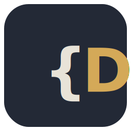

<p align="center">
  
</p>

# Doctrina

> Spec-driven, AGENTS.md-native framework for multi-agent AI development.

The bottleneck of AI-assisted development is not code generation — it is
the reliable transfer of intent and the persistence of context across
sessions and agents. Doctrina treats **specifications as the single
source of truth**, keeps architectural decisions as **immutable ADRs**,
and orchestrates work through a **single linear coordinator** instead of
competing parallel agents. Everything is plain Markdown and JSON in git:
no database, no vector store, no telemetry, zero runtime dependencies.

| | |
|---|---|
| **Works with** | Claude Code, OpenAI Codex CLI, Cursor, GitHub Copilot, Gemini CLI, Aider, Windsurf, Continue, Amp, Devin, Factory, Jules |
| **Requires** | Node.js ≥ 20.12, git |
| **Install** | `npm install -g doctrina-cli` or `npx doctrina-cli` |
| **License** | MIT |

## Usage in 5 minutes

**1. Initialise a project** — scaffolds `AGENTS.md` (the portable rules
file every agent reads) plus the `.doctrina/` artifact tree, and installs
thin adapters for every supported agent:

```sh
cd my-project
npx doctrina-cli init --agent all
npx doctrina-cli hooks install        # pre-commit: validate --fix on every commit (self-heals index drift)
```

**2. Describe a capability** — the spec is the current truth of what the
system does, written in EARS requirements:

```sh
doctrina spec new billing
# edit .doctrina/specs/billing/spec.md — or ask your agent to fill it in
```

**3. Open a change** — the unit of work. The proposal answers *why*, the
tasks list the work, deltas describe spec updates:

```sh
doctrina change new 0001-late-fees "Charge late fees"
doctrina next                          # the CLI tells you what to do next
```

**4. Let your agent work** — agents read `AGENTS.md` automatically.
To hand one the exact context for the task:

```sh
doctrina context billing --concat | <your agent>
```

**5. Apply, verify, archive:**

```sh
doctrina change diff 0001-late-fees    # preview every delta
doctrina change apply 0001-late-fees   # ADDED/REMOVED auto, MODIFIED manual
doctrina validate                      # 18 structural checks
doctrina change archive 0001-late-fees # history out of the read path
```

**6. Record decisions as you go:**

```sh
doctrina decision new "Use Postgres for the ledger"
doctrina decision accept 0001
```

Three months later, "why Postgres?" is answered by a file, not by
archaeology. Continue with **[Getting started](getting-started.md)** for
the full walkthrough, or **[Workflow](workflow.md)** for the
propose → apply → archive cycle in depth.

## The command surface

27 commands, 40 operations, zero dependencies — see the
**[CLI reference](cli-reference.md)** for all of them. The ones you will
use daily:

| Command | What it does |
|---------|--------------|
| `doctrina next` | Tells you (or your agent) the next recommended action |
| `doctrina context <cap>` | Prints the exact context pack, in read order |
| `doctrina validate` | 18 schema/structure/EARS checks, CI-friendly |
| `doctrina search <term>` | "Where is X decided?" across all artifacts |
| `doctrina metrics --save` | Local git-derived adoption metrics, no network |

## Why not just prompt harder?

Anthropic measured that on the BrowseComp evaluation **token usage alone
explains 80% of the variance in task performance**
([source](https://www.anthropic.com/engineering/built-multi-agent-research-system)).
Doctrina invests where the data points: dense, well-scoped, versioned
context artifacts — not more agents, roles, or parallelism. Read
**[Context engineering](context-engineering.md)** for the full argument
and **[Comparison](comparison.md)** for honest positioning against
Spec Kit, OpenSpec, Kiro, BMAD, and SpecWeave.

## Project

- **[Contributing](contributing.md)** — two workflows, Conventional
  Commits, how to add an adapter.
- **[Donations](donations.md)** — support the project.
- **[Changelog](https://github.com/GCarin1/Doctrina/blob/main/CHANGELOG.md)** ·
  **[Security policy](https://github.com/GCarin1/Doctrina/blob/main/SECURITY.md)** ·
  **[MIT License](https://github.com/GCarin1/Doctrina/blob/main/LICENSE)**
