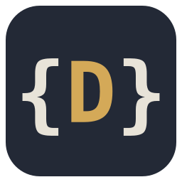

<p align="center">
  
</p>

# Doctrina

> Spec-driven, AGENTS.md-native framework for multi-agent AI development.

The bottleneck of AI-assisted development is not code generation — it is
the reliable transfer of intent and the persistence of context across
sessions and agents. Doctrina treats **specifications as the single
source of truth**, keeps architectural decisions as **immutable ADRs**,
and orchestrates work through a **single linear coordinator** instead of
competing parallel agents. Everything is plain Markdown and JSON in git:
no database, no vector store, no telemetry, zero runtime dependencies.

| | |
|---|---|
| **Works with** | Claude Code, OpenAI Codex CLI, Cursor, GitHub Copilot, Gemini CLI, Aider, Windsurf, Continue, Amp, Devin, Factory, Jules |
| **Requires** | Node.js ≥ 20.12, git |
| **Install** | `npm install -g doctrina-cli` or `npx doctrina-cli` |
| **License** | MIT |

## Usage in 5 minutes

You describe and approve; your agent runs the commands. Each step below
names what it runs, so you can follow along or drive by hand.

**1. Initialise the repository** — scaffolds `AGENTS.md` (the portable
rules file every agent reads) plus the `.doctrina/` artifact tree, and
installs thin adapters for every supported agent. At a terminal, `init`
asks you to describe the project once, and keeps the answer:

```sh
cd my-project
npx doctrina-cli init --agent all
npx doctrina-cli hooks install        # pre-commit: validate --fix, then index rebuild --check --staged
```

**2. Hand over to your agent** — tell it *"read AGENTS.md and run
`doctrina next`"*. It turns your description into `product.md` and one
EARS spec per capability (the bootstrap playbook), then asks you to
review them:

```sh
doctrina next      # a pending intake awaits conversion → doctrina intake
```

**3. Ask for a change in plain words** — every request becomes a change:
a proposal (*why*), tasks, and spec deltas, with a playbook the agent
follows. It loads exactly the context the task needs:

```sh
doctrina work "charge a late fee on overdue invoices"
doctrina context billing --for "late fees" --concat
```

**4. Close it** — one attested pass applies the deltas (mechanically,
from their `ops` blocks), runs the project's own checks, and archives the
change. Preview first to see everything it would refuse:

```sh
doctrina change check 0001-late-fees --verbose   # the dry-run, every delta shown
doctrina close 0001-late-fees                    # the whole closing sequence, one attested pass
```

**5. Record decisions as you go:**

```sh
doctrina decision new "Use Postgres for the ledger"
doctrina decision accept 0001
```

Three months later, "why Postgres?" is answered by a file, not by
archaeology. Continue with **[Getting started](getting-started.md)** for
the full walkthrough, or **[Workflow](workflow.md)** for the
propose → apply → archive cycle in depth.

## The command surface

37 commands, 59 operations, zero dependencies — see the
**[CLI reference](cli-reference.md)** for all of them. Those two numbers
are checked against the CLI's own catalog, so this page cannot quietly
fall behind it. The ones you will
use daily:

| Command | What it does |
|---------|--------------|
| `doctrina prime` | The session primer: gates, rules, open work, next steps in one read |
| `doctrina next` | Tells you (or your agent) the next recommended action |
| `doctrina work "<prompt>"` | Turns a request into a change and prints the playbook to follow |
| `doctrina close <id>` | The definition of done: apply, verify, archive, validate in one pass |
| `doctrina context <cap>` | Prints the exact context pack, in read order |
| `doctrina validate` | Schema, structure, EARS and index-drift checks (each one listed in the [CLI reference](cli-reference.md)), CI-friendly |
| `doctrina search <term>` | "Where is X decided?" across all artifacts |

## Why not just prompt harder?

Anthropic measured that on the BrowseComp evaluation **token usage alone
explains 80% of the variance in task performance**
([source](https://www.anthropic.com/engineering/built-multi-agent-research-system)).
Doctrina invests where the data points: dense, well-scoped, versioned
context artifacts — not more agents, roles, or parallelism. Read
**[Context engineering](context-engineering.md)** for the full argument
and **[Comparison](comparison.md)** for honest positioning against
Spec Kit, OpenSpec, Kiro, BMAD, and SpecWeave.

## Project

- **[Contributing](contributing.md)** — two workflows, Conventional
  Commits, how to add an adapter.
- **[Donations](donations.md)** — support the project.
- **[Changelog](https://github.com/GCarin1/Doctrina/blob/main/CHANGELOG.md)** ·
  **[Security policy](https://github.com/GCarin1/Doctrina/blob/main/SECURITY.md)** ·
  **[MIT License](https://github.com/GCarin1/Doctrina/blob/main/LICENSE)**
