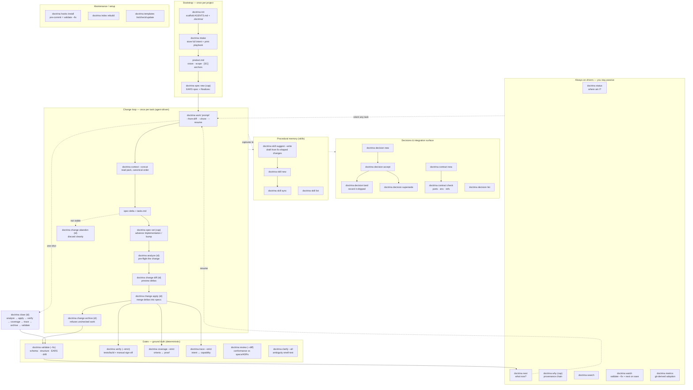

# Flow diagram — every command

How the whole `doctrina` surface fits together. The README shows the **main
path**; this page shows the **flow of every command**, grouped by the moment you
reach for it. (The CLI is deterministic — it scaffolds, sequences, and checks;
semantic judgement stays the agent/human's job, per ADR 0005.)

## The flow of each command

**Bootstrap (once).**
- `doctrina init` — scaffold `AGENTS.md` and the `.doctrina/` skeleton.
- `doctrina intake` — store the full project description and print the bootstrap
  playbook (fill `product.md`, derive capabilities, one EARS spec each, gate).
- `doctrina spec new <cap>` (`--bug`) / `spec list` / `spec set <cap>` — create,
  inventory, and edit specs; `spec set` advances `Implementation:` / bumps the
  version and resyncs the index in one step.

**Change loop (per task).**
- `doctrina work "<prompt>"` — scaffold a change and print the playbook
  (`--from-diff` backfills from code, `--chore` is the spec-less lane,
  `--resume` reprints an open change's playbook).
- `doctrina context [<cap>] --concat` — assemble the read pack in canonical
  order. Run it for any task, not only `work`.
- `doctrina analyze <id>` → `change diff <id>` → `change apply <id>` →
  `change archive <id>` — pre-flight, preview, merge deltas into specs, then
  archive (which refuses unchecked work). `change abandon <id>` discards.

**Gates (ground truth).**
- `doctrina validate` (`--fix`) — schema, structure, EARS, and index drift
  (`--fix` heals drift; the pre-commit hook runs this).
- `doctrina verify` (`--strict`, `--signoff`) — the real build/test gate, plus
  `type: manual` qualitative checks recorded as sign-offs.
- `doctrina coverage --strict` — every acceptance criterion cites real proof.
- `doctrina trace --strict` — product intent maps to a capability.
- `doctrina review [--diff <ref>]` — structural conformance of your changes vs
  the spec/ADR/contract tree (the agent self-reviews before handoff).
- `doctrina clarify [--all]` — ambiguity smell-test on Markdown.

**One-shot close.**
- `doctrina close <id>` — runs analyze → apply → verify → coverage → trace →
  archive → validate in one pass, stopping at the first failure.

**Decisions & contracts.**
- `doctrina decision new → accept → land` (or `supersede`), `decision list` —
  immutable ADRs; `land` records that an accepted decision shipped.
- `doctrina contract new` / `contract check` — own and verify the integration
  surface (ports, env, referenced specs).

**Procedural memory (skills).**
- `doctrina skill suggest [--write]` — surface (and scaffold) skills worth
  capturing from fix-shaped changes. `skill new` / `sync` / `list` round it out.

**Always-on drivers (you stay passive).**
- `doctrina status` — one-glance health. `doctrina next` — the recommended next
  action. `doctrina why <cap>` — a capability's provenance chain.
  `doctrina search` — find artifacts. `doctrina watch` — re-run `validate --fix`
  + `next` on every save. `doctrina metrics` — git-derived adoption signals.

**Maintenance / setup.**
- `doctrina hooks install` — pre-commit = `validate --fix`. `doctrina index
  rebuild` — regenerate the index from the tree. `doctrina templates
  list|check|update` — inspect/refresh the shipped templates.

See the **[CLI reference](cli-reference.md)** for every flag and exit code.
