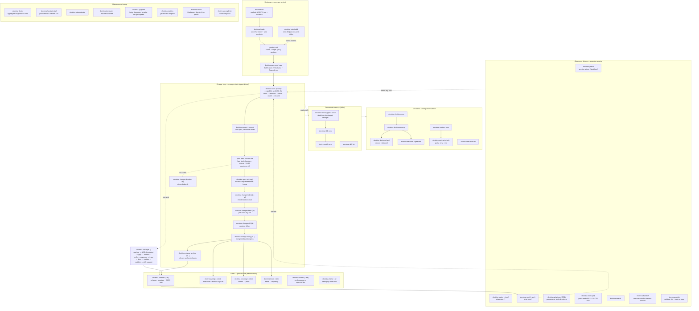

# Flow diagram — every command

How the whole `doctrina` surface fits together. The README shows the **main
path**; this page shows the **flow of every command**, grouped by the moment you
reach for it. (The CLI is deterministic — it scaffolds, sequences, and checks;
semantic judgement stays the agent/human's job, per ADR 0005.)

```mermaid
flowchart TD
    subgraph BOOT["Bootstrap — once per project"]
        direction TB
        init["doctrina init<br/>scaffold AGENTS.md + .doctrina/"]
        intake["doctrina intake<br/>store full intent + print playbook"]
        product["product.md<br/>vision · scope · [SC] anchors"]
        specnew["doctrina spec new (cap)<br/>EARS spec + Realizes: + Depends on:"]
        intentadd["doctrina intent add<br/>new [SC] anchor post-intake"]
        init --> intake --> product --> specnew
        intentadd -. "intent evolves" .-> product
    end

    subgraph LOOP["Change loop — once per task (agent-driven)"]
        direction TB
        work["doctrina work 'prompt'<br/>--capability scaffolds the delta · --from-diff · --chore · --quiet · --resume"]
        context["doctrina context --concat<br/>read pack, canonical order"]
        delta["spec delta + tasks.md<br/>(ops block: headers · criteria · EARS requirements)"]
        specset["doctrina spec set (cap)<br/>advance Implementation / bump"]
        ctick["doctrina change tick (id) --all<br/>check boxes in bulk"]
        ccheck["doctrina change check (id)<br/>pre-close dry-run"]
        cdiff["doctrina change diff (id)<br/>preview deltas"]
        capply["doctrina change apply (id...)<br/>merge deltas into specs"]
        carchive["doctrina change archive (id...)<br/>refuses unchecked work"]
        cabandon["doctrina change abandon (id)<br/>discard cleanly"]
        work --> context --> delta --> specset --> ctick --> ccheck --> cdiff --> capply --> carchive
        delta -. "not viable" .-> cabandon
    end

    subgraph GATES["Gates — ground truth (deterministic)"]
        direction TB
        validate["doctrina validate (--fix)<br/>schema · structure · EARS · drift"]
        verify["doctrina verify (--strict)<br/>tests/build + manual sign-off"]
        coverage["doctrina coverage --strict<br/>criteria ↔ proof"]
        trace["doctrina trace --strict<br/>intent ↔ capability"]
        review["doctrina review (--diff)<br/>conformance vs specs/ADRs"]
        clarify["doctrina clarify --all<br/>ambiguity smell-test"]
    end

    close["doctrina close (id...)<br/>analyze → ADR checkpoint → apply → runtime → verify → coverage → trace → docs → archive → validate → skill suggest"]

    subgraph GOV["Decisions & integration surface"]
        direction TB
        decnew["doctrina decision new"]
        decaccept["doctrina decision accept"]
        decland["doctrina decision land<br/>record it shipped"]
        decsuper["doctrina decision supersede"]
        declist["doctrina decision list"]
        decnew --> decaccept --> decland
        decaccept --> decsuper
        contractnew["doctrina contract new"]
        contractcheck["doctrina contract check<br/>ports · env · refs"]
        contractnew --> contractcheck
    end

    subgraph MEM["Procedural memory (skills)"]
        direction TB
        skillsuggest["doctrina skill suggest --write<br/>draft from fix-shaped changes"]
        skillnew["doctrina skill new"]
        skillsync["doctrina skill sync"]
        skilllist["doctrina skill list"]
        skillsuggest --> skillnew --> skillsync
    end

    subgraph NAV["Always-on drivers — you stay passive"]
        direction TB
        prime["doctrina prime<br/>session primer (start here)"]
        status["doctrina status (--json)<br/>where am I?"]
        next["doctrina next (--json)<br/>what now?"]
        why["doctrina why (cap | SC1)<br/>provenance, both directions"]
        show["doctrina show (ref)<br/>point-read cli-R12 / cli-C3 / 0007"]
        search["doctrina search"]
        handoff["doctrina handoff<br/>resume note for the next session"]
        watch["doctrina watch<br/>validate --fix + next on save"]
    end

    subgraph OPS["Maintenance / setup"]
        direction TB
        doctor["doctrina doctor<br/>aggregate diagnostic + fixes"]
        hooks["doctrina hooks install<br/>pre-commit = validate --fix"]
        indexrebuild["doctrina index rebuild"]
        templates["doctrina templates list/check/update"]
        upgradecmd["doctrina upgrade<br/>bring the project up after an npm update"]
        metrics["doctrina metrics<br/>git-derived adoption"]
        reportcmd["doctrina report<br/>Markdown digest of the period"]
        completion["doctrina completion<br/>bash/zsh/pwsh"]
    end

    specnew --> work
    capply --> verify
    capply --> coverage
    capply --> trace
    carchive --> validate
    work -. "one-shot" .-> close
    close --> validate
    validate --> next
    next -. "resume" .-> work
    LOOP -. "records decisions" .-> GOV
    LOOP -. "captures lessons" .-> MEM
    NAV -. "orient any task" .-> work
```

## The flow of each command

**Bootstrap (once).**
- `doctrina init` — scaffold `AGENTS.md` and the `.doctrina/` skeleton.
- `doctrina intake` — store the full project description and print the bootstrap
  playbook (fill `product.md`, derive capabilities, one EARS spec each, gate).
- `doctrina spec new <cap>` (`--bug`) / `spec list` / `spec set <cap>` — create,
  inventory, and edit specs; `spec set` advances `Implementation:` / bumps the
  version and resyncs the index in one step.
- `doctrina intent add "<text>"` / `intent list` — append a new `[SC]` anchor to
  product.md when intent evolves after the intake, so new capabilities get
  something to `Realizes:` instead of landing at `n/a`.

**Change loop (per task).**
- `doctrina work "<prompt>"` — scaffold a change and print the playbook
  (`--from-diff` backfills from code, `--chore` is the spec-less lane,
  `--resume` reprints an open change's playbook).
- `doctrina context [<cap>] --concat` — assemble the read pack in canonical
  order, with token estimates. Run it for any task, not only `work`
  (`--budget <n>` gates the size; `--diff <ref>` is the resume-session pack).
- `doctrina change tick <id> [--all]` → `change check <id>` → `analyze <id>` →
  `change diff <id>` → `change apply <id...>` → `change archive <id...>` —
  bulk-check the boxes, dry-run everything close would refuse, pre-flight,
  preview, merge deltas into specs (ops blocks cover headers, criteria, and
  EARS requirement bullets), then archive (which refuses unchecked work).
  apply/archive/check take multiple ids. `change abandon <id>` discards.

**Gates (ground truth).**
- `doctrina validate` (`--fix`) — schema, structure, EARS, and index drift
  (`--fix` heals drift; the pre-commit hook runs this).
- `doctrina verify` (`--strict`, `--signoff`) — the real build/test gate, plus
  `type: manual` qualitative checks recorded as sign-offs.
- `doctrina coverage --strict` — every acceptance criterion cites real proof.
- `doctrina trace --strict` — product intent maps to a capability.
- `doctrina review [--diff <ref>]` — structural conformance of your changes vs
  the spec/ADR/contract tree (the agent self-reviews before handoff).
- `doctrina clarify [--all]` — ambiguity smell-test on Markdown.

**One-shot close.**
- `doctrina close <id...>` — runs analyze → ADR checkpoint (advisory) →
  apply → **runtime** → verify → coverage → trace → **docs** → archive →
  validate → skill suggest (advisory) in one pass, stopping at the first
  failure. Takes multiple ids. The runtime gate holds each contract's
  declared wiring, enums and selectors to the implementation (RT01-RT05):
  an error blocks, a warning is reported and the close continues. The docs
  gate refuses a change that alters a documented surface with no
  documentation beside it; `--force` records the gap.

**Decisions & contracts.**
- `doctrina decision new → accept → land` (or `supersede`), `decision list` —
  immutable ADRs; `land` records that an accepted decision shipped.
- `doctrina contract new` / `contract check` — own and verify the integration
  surface (ports, env, referenced specs).

**Procedural memory (skills).**
- `doctrina skill suggest [--write]` — surface (and scaffold) skills worth
  capturing from fix-shaped changes. `skill new` / `sync` / `list` round it out.

**Always-on drivers (you stay passive).**
- `doctrina prime` — the session primer: gates, rules, open work, next steps
  in one ~40-line read (start every session here). `doctrina status` —
  one-glance health. `doctrina next` — the recommended next action.
  `doctrina why <cap|SC1>` — provenance in either direction.
  `doctrina show <ref>` — point-read one requirement/criterion/ADR
  (`cli-R12`, `cli-C3`, `0007`). `doctrina search` — find artifacts.
  `doctrina handoff` — the Markdown resume note for the next session.
  `doctrina watch` — re-run `validate --fix` + `next` on every save.
  `status`/`next`/`validate`/`coverage`/`trace` all speak `--json`.
  `prime`, `handoff` and `report` are **views of one snapshot** — the same
  bytes as `doctrina status --view prime|handoff|report`, rendered from a
  single collection of the tree, so the four can never report different
  numbers.

**Maintenance / setup.**
- `doctrina doctor` — aggregate diagnostic with per-finding remediation.
  `doctrina hooks install` — pre-commit = `validate --fix`. `doctrina index
  rebuild` — regenerate the index from the tree. `doctrina templates
  list|check|update` — inspect/refresh the shipped templates.
  `doctrina upgrade` (`--write`) — bring an existing project up to the
  installed CLI after an npm update (templates update → index/stamp →
  validate). `doctrina metrics` — git-derived adoption signals.
  `doctrina report` — Markdown digest of the period.
  `doctrina completion bash|zsh|pwsh` — shell completions generated from
  the catalog.

See the **[CLI reference](cli-reference.md)** for every flag and exit code.
