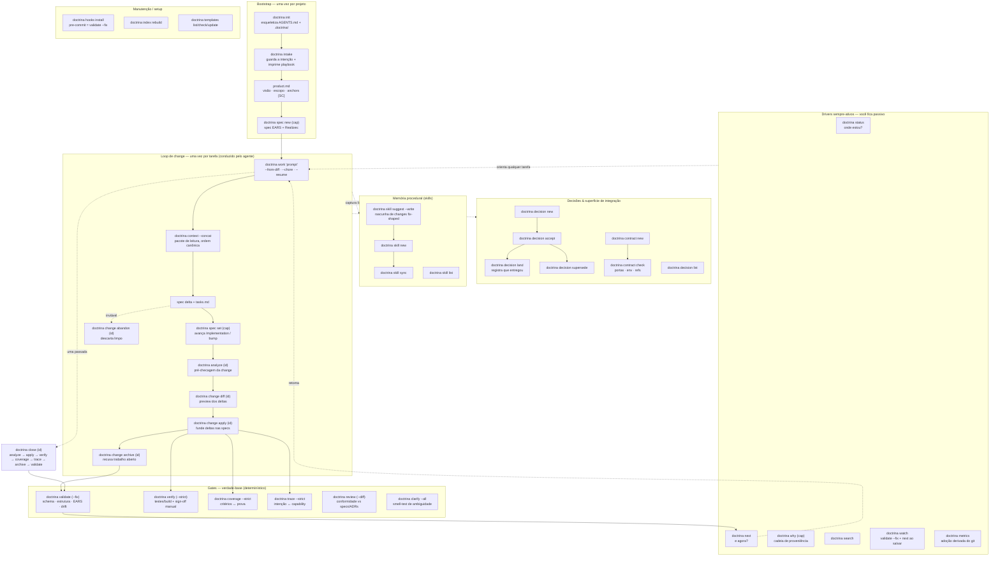

# Diagrama de fluxo — cada comando

Como toda a superfície do `doctrina` se encaixa. O README mostra o **caminho
principal**; esta página mostra o **fluxo de cada comando**, agrupado pelo
momento em que você o usa. (O CLI é determinístico — esqueletiza, sequencia e
checa; o julgamento semântico fica com o agente/humano, conforme o ADR 0005.)

## O fluxo de cada comando

**Bootstrap (uma vez).**
- `doctrina init` — esqueletiza `AGENTS.md` e o esqueleto `.doctrina/`.
- `doctrina intake` — guarda a descrição completa do projeto e imprime o playbook
  de bootstrap (preencher `product.md`, derivar capabilities, uma spec EARS cada,
  rodar os gates).
- `doctrina spec new <cap>` (`--bug`) / `spec list` / `spec set <cap>` — cria,
  inventaria e edita specs; `spec set` avança `Implementation:` / bumpa a versão e
  re-sincroniza o índice numa passada.

**Loop de change (por tarefa).**
- `doctrina work "<prompt>"` — esqueletiza uma change e imprime o playbook
  (`--from-diff` faz backfill a partir do código, `--chore` é a faixa sem spec,
  `--resume` reimprime o playbook de uma change aberta).
- `doctrina context [<cap>] --concat` — monta o pacote de leitura na ordem
  canônica. Rode em qualquer tarefa, não só no `work`.
- `doctrina analyze <id>` → `change diff <id>` → `change apply <id>` →
  `change archive <id>` — pré-checa, preview, funde deltas nas specs e arquiva
  (recusando trabalho aberto). `change abandon <id>` descarta.

**Gates (verdade-base).**
- `doctrina validate` (`--fix`) — schema, estrutura, EARS e drift do índice
  (`--fix` cura o drift; o hook de pre-commit roda isto).
- `doctrina verify` (`--strict`, `--signoff`) — o gate real de build/teste, mais
  checagens qualitativas `type: manual` registradas como sign-offs.
- `doctrina coverage --strict` — todo critério de aceite cita prova real.
- `doctrina trace --strict` — a intenção de produto mapeia para uma capability.
- `doctrina review [--diff <ref>]` — conformidade estrutural das suas mudanças vs
  a árvore de specs/ADRs/contratos (o agente se autorevisa antes de entregar).
- `doctrina clarify [--all]` — smell-test de ambiguidade em Markdown.

**Fechamento em uma passada.**
- `doctrina close <id>` — roda analyze → apply → verify → coverage → trace →
  archive → validate numa passada, parando na primeira falha.

**Decisões & contratos.**
- `doctrina decision new → accept → land` (ou `supersede`), `decision list` —
  ADRs imutáveis; `land` registra que uma decisão aceita foi entregue.
- `doctrina contract new` / `contract check` — é dono e verifica a superfície de
  integração (portas, env, specs referenciadas).

**Memória procedural (skills).**
- `doctrina skill suggest [--write]` — mostra (e esqueletiza) skills que valem ser
  capturadas a partir de changes fix-shaped. `skill new` / `sync` / `list`
  completam.

**Drivers sempre-ativos (você fica passivo).**
- `doctrina status` — saúde num olhar. `doctrina next` — a próxima ação
  recomendada. `doctrina why <cap>` — a cadeia de proveniência de uma capability.
  `doctrina search` — encontra artefatos. `doctrina watch` — re-roda
  `validate --fix` + `next` a cada save. `doctrina metrics` — sinais de adoção
  derivados do git.

**Manutenção / setup.**
- `doctrina hooks install` — pre-commit = `validate --fix`. `doctrina index
  rebuild` — regenera o índice a partir da árvore. `doctrina templates
  list|check|update` — inspeciona/atualiza os templates distribuídos.

Veja a **[Referência do CLI](cli-reference.md)** para cada flag e exit code.
